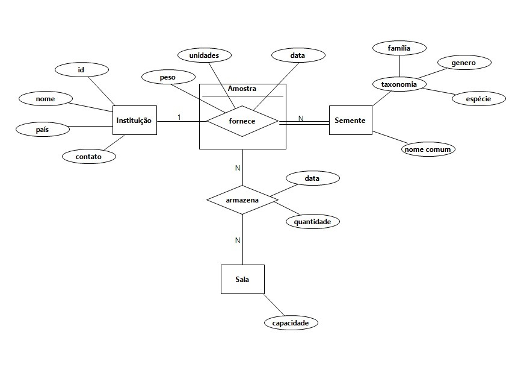

# Repositório Global de Sementes

Este repositório contém os artefatos para a geração de um banco de dados NoSQL, orientado a documentos, para um Repositório Global de Sementes.

## Equipe
* Jesper Ian Santos Brayner Rodrigues Alves <[jisbra](mailto:jisbra@cin.ufpe.br)>
* João Vitor Figueiredo de Vasconcelos <[jvfv](mailto:jvfv@cin.ufpe.br)>
* Luan Gustavo Nogueira de Souza <[lgns](mailto:lgns@cin.ufpe.br)>
* Luís Eduardo Cavalcante Santos <[lecs2](mailto:lecs2@cin.ufpe.br)>
* Mairon Rodrigues Nunes <[mrn](mailto:mrn@cin.ufpe.br)>
* Nara Maria Silva de Pontes <[nmsp](mailto:nmsp@cin.ufpe.br)>

## Estrutura do Repositório

- [`package.json`](./package.json) e [`package-lock.json`](./package-lock.json): define as dependências do projeto, incluindo os pacotes `mongodb` e `dotenv`.
- [`.env.example`](./.env.example): arquivo para configuração da string de conexão com o banco de dados.

Além desses arquivos, temos os seguintes arquivos e diretórios:

- [`scripts/instituicao/registros_instituicao.js`](./scripts/instituicao/registros_instituicao.js): dados referentes às instituições parceiras.

- [`scripts/sala/registros_sala.js`](./scripts/sala/registros_sala.js): dados contendo a capacidade de cada sala de armazenamento.

- [`scripts/amostra/registros_amostra.js`](./scripts/amostra/registros_amostra.js): dados contendo os lotes de sementes e onde estão guardados.

- [`scripts/movimentacao/log_movimentacao.js`](./scripts/movimentacao/log_movimentacao.js): dados com o histórico de interações com o estoque.

- [`scripts/load_seeds.js`](./scripts/load_seeds.js): script que se conecta ao MongoDB (database repositorio-sementes) e insere todos os registros iniciais no banco.

- [`queries/`](./queries/): todas as queries atendendo aos requisitos de comandos do projeto.

## Modelagem dos dados

Antes de realizar a implementação em si no MongoDB, precisamos modelar os dados de acordo com o Modelo Entidade-relacionamento e convertendo isso posteriormente em uma modelagem física. Nesse processo, temos o seguinte resultado:

### Modelagem conceitual

As entidades, ou seja, elementos do mundo real, que estão representadas na nossa modelagem são as seguintes:

1. `Instituição`: Representa a organização parceira fornecedora. Ela é descrita pelos atributos id, nome, país e contato.

2. `Semente`: É o catálogo científico da amostra. Possui o atributo nome comum e um atributo especial composto chamado taxonomia, que se ramifica em família, genero e espécie.

3. `Sala`: Representa o local de armazenamento físico no prédio. Possui o atributo capacidade para definir seu limite de alocação.

Além dessas entidades, possuímos uma entidade associativa para `Amostra` que representa um lote de sementes que pertencem a uma instituição. Essa entidade possui os dados específicos daquele lote que acabou de chegar, que são independentes dos dados biológicos da semente. Seus atributos independentes são: peso, unidades e a data em que esse lote foi fornecido.

Ademais, o modelo também é composto por dois relacionamentos:

1. Relacionamento fornece (1:N)
- 1 Instituição pode fornecer N Sementes diferentes para o banco de dados. 
- 1 Semente deve ser fornecida por somente 1 Instituição

2. Relacionamento armazena (N:N)
- 1 Sala pode armazenar N Amostras
- 1 Amostra pode ser armazenada por N Salas distintas

Ao final, temos a seguinte modelagem:



### Implementação física em coleções
Diferente da implementação que já havíamos feito para o modelo relacional com base no Modelo ER nos demais projetos, realizamos uma modelagem projetada para uma estrutura orientada a documentos, implementando aninhamento de objetos (*embedding*) para agrupar informações logicamente relacionadas.

As coleções implementadas foram as seguintes:

#### Coleção `Instituição`

```javascript
Instituição {
	_id: ObjectId
	id: int
	nome: string
	país: string
	contato: {
		e-mails: array [string]
		telefones: array [int]
	}
}
```

#### Coleção `Amostra`

```javascript
Amostra {
	_id: ObjectId
	código: string
	instituição: int
	semente: {
		família: string
		gênero: string
		espécie: string
	    nome_comum: string
	}
	armazenamento: {
		sala: string
		módulo: int
		estante: int
	}
	data_entrada: timestamp
	unidades: int
	peso: double
}
```

#### Coleção `Sala`

```javascript
Sala {
	_id: ObjectId
	id: string
	capacidade: int
}
```

#### Coleção `Movimentação`

```javascript
Movimentação {
	_id: ObjectId
	amostra: string
	tipo: string
	razão: string
	data: timestamp
	quantidade: int
}
```

## Como executar
Para configurar e rodar o projeto localmente:

1. Tendo o `.env.example` como base, configure a variável `DB_URL` no arquivo `.env` para apontar para sua instância do MongoDB.

2. Baixe as dependências executando o comando `npm install` na raiz do repositório.

3. Insira os registros no banco executando o script principal: `node scripts/load_seeds.js`.
- O terminal confirmará a inserção retornando a contagem de documentos criados para Instituições, Salas, Amostras e Movimentações.